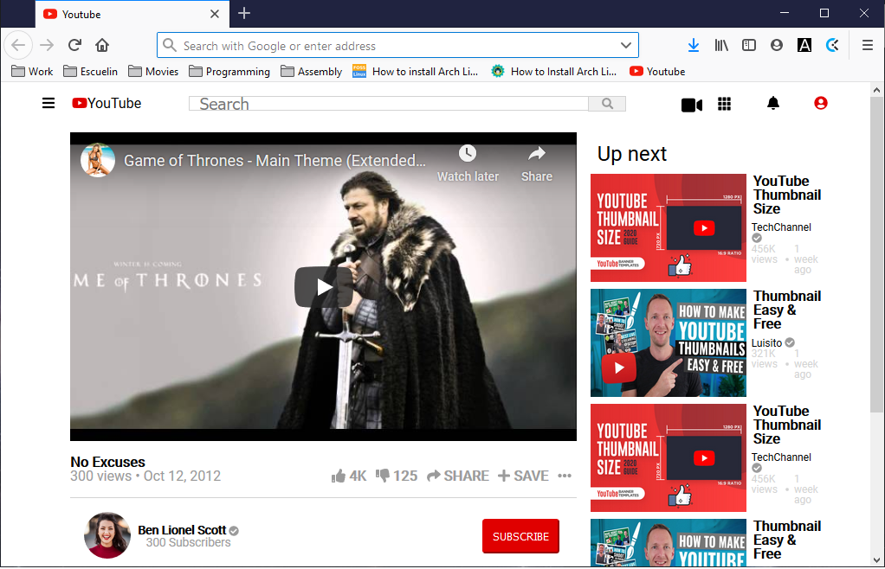

# YouTube Clone

This project consists of building an HTML document that matches the appearance of youtube video player page for learning purpose

    Additional description about the project and its features.

## Built With

    - Plain HTML5,
    - Pure CSS3,

## Live Demo

[Live Demo Link](https://mcervantes71.github.io/YouTubeClone/index.html)

## Getting Started

    To get a local copy up and running follow these simple example steps.

### Install

    Download the repository

### Usage

    In any browser, open the index.html file

## Authors

👤 **Author1**

- Gmail: [Teshager Admasu](mailto:teshager8922@gmail.com)
- Github: [@teshager21](https://github.com/teshager21)
- Twitter: [@Teshage84907805](https://twitter.com/Teshage84907805)
- Linkedin: [Teshager Admasu](https://www.linkedin.com/in/teshager-admasu-0000011a2/)

👤 **Author2**

- Gmail: [Martin Cervantes](mailto:cervantes.martine@gmail.com)
- Github: [@mcervantes71](https://github.com/mcervantes71)
- Twitter: [@M4rt1nC3rv4nt3s](https://twitter.com/M4rt1nC3rv4nt3s)
- Linkedin: [Martin Cervantes](https://www.linkedin.com/in/cervantesmartin/)

## 🤝 Contributing

    Contributions, issues and feature requests are welcome!

Feel free to check the [issues page](issues/).

## Show your support

    Give a ⭐️ if you like this project!

## 📝 License

This project is [MIT](lic.url) licensed.
