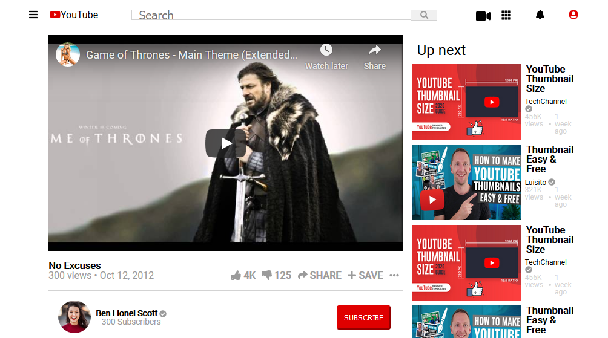

# YouTube Clone

    This project consists of building an HTML document that matches the appearance of youtube video
    player page for learning purpose.

## :package: Built With

    - Plain HTML5
    - Pure CSS3
    - Font Awesome

## :mag: Live Demo

[Live Demo Link](https://mcervantes71.github.io/YouTubeClone/index.html)

## :busts_in_silhouette: Authors

👤 **Teshager Admasu**

- Linkedin: [Teshager Admasu](https://www.linkedin.com/in/teshager-admasu-0000011a2/)
- Twitter: [@Teshage84907805](https://twitter.com/Teshage84907805)
- Github: [@teshager21](https://github.com/teshager21)
- Gmail: [teshager8922](mailto:teshager8922@gmail.com)

👤 **Martin Cervantes**

- Linkedin: [Martin Cervantes](https://www.linkedin.com/in/cervantesmartin/)
- Twitter: [@M4rt1nC3rv4nt3s](https://twitter.com/M4rt1nC3rv4nt3s)
- Github: [@mcervantes71](https://github.com/mcervantes71)
- Gmail: [cervantes.martine](mailto:cervantes.martine@gmail.com)

## 🤝 Contributing

    Contributions, issues and feature requests are welcome!

Feel free to check the [issues page](../../issues).

## :star2: Show your support

    Give a ⭐️ if you like this project!

## 📝 License

This project is [MIT](lic.url) licensed.
